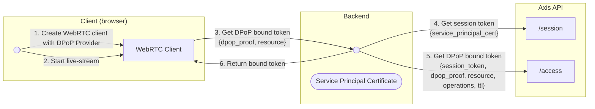

# Code examples

## Live stream video examples

The following examples shows how to use the Axis Web Video Player to live stream video from a camera using WebRTC with different credentials providers.

### Using OpenID Connect (OIDC)

An example how to use the video player together with [Authorization Code Flow with Proof Key for Code Exchange (PKCE)](https://auth0.com/docs/get-started/authentication-and-authorization-flow/authorization-code-flow-with-pkce) with a sign in popup. After the user has signed in the live stream will start at the specified `videoElement` sent in the `startLiveStream` options.

```ts
import { OidcProvider, WebRtcClient, EdgeLiveStreamDetails } from "@axiscommunications/axis-web-video-player";

// Create an OIDC provider.
const oidcProvider = new OidcProvider({
  clientId: "oidc-client-id",
  endpoint: "https://your-oidc-endpoint",
  redirectUri: "http://localhost/login-callback"
});

// Handle the OIDC callback.
if (window.location.pathname === "/login-callback") {
  oidcProvider.handleSignInCallback();
  return;
}

// Create a WebRTC client.
const webRtcClient = new WebRtcClient({
  credentialsProvider,
  orgId: "organization-id",
  targetId: "target-id",
});

// Create stream details object that describes properties of the video stream.
const streamDetails = new EdgeLiveStreamDetails({
  width: 1280,
  height: 720,
  framerate: 30,
});

// Sign in the user using a popup.
await oidcProvider.signInPopup();

// Start the live stream on the specified html element.
await webRtcClient.startLiveStream({
  streamDetails,
  videoElement: document.querySelector("#video"),
});
```

### Using DPoP with callback

In this example the video player is used together with [DPoP](https://datatracker.ietf.org/doc/html/draft-ietf-oauth-dpop-03) with a callback function.



The `onGetBoundToken` function is called with the DPoP proof and the resource to get a bound token. After the bound token is received the live stream will start at the specified `videoElement` sent in the `startLiveStream` options.

```ts
import { CustomDPopProvider, WebRtcClient, EdgeLiveStreamDetails } from "@axiscommunications/axis-web-video-player";

// Generate a key pair to be used for DPoP proof generation.
const keyPair = await CustomDPopProvider.generateKeyPair();

/**
 * Create a DPoP provider. Depending on the value of `resource` this can be reused for
 * multiple clients. If the resource is for a specific camera a new provider should be created
 * for each client.
 *
 * `resource` is an identifier for the resource to get a bound token for. This can be either a
 * specific camera or a group id of cameras to be able to reuse the same token for.
 *
 * `onGetBoundToken` is a callback function that will be called with the DPoP proof and the
 * resource to get a bound token.
 */
const dPopProvider = new CustomDPopProvider({
  keyPair,
  resource: "resource-id",
  onGetBoundToken,
});

/**
 * Create a WebRTC client.
 * `orgId` is the id of the organization that the camera belongs to.
 * `targetId` is the id of the camera. This can for example be the serial number.
 */
const webRtcClient = new WebRtcClient({
  credentialsProvider,
  orgId: "organization-id",
  targetId: "target-id",
});

// Create stream details object that describes properties of the video stream.
const streamDetails = new EdgeLiveStreamDetails({
  width: 1280,
  height: 720,
  framerate: 30,
});

// Start the live stream on the specified html element.
await webRtcClient.startLiveStream({
  streamDetails,
  videoElement: document.querySelector("#video"),
});

// `resource` will be the one provided in the `CustomDPopProvider` constructor.
const onGetBoundToken = async (dPopProof, resource) => {
  /**
   * Send the DPoP proof and the resource to the backend server to get a bound token.
   * This request can also include other information such as the user's identity to be able
   * to check if the user has access to the resource.
   */
  const response = await fetch("http://localhost/auth", {
    method: "POST",
    headers: {
      "Content-Type": "application/json",
    },
    body: JSON.stringify({
      dPopProof,
      resource,
    }),
  });

  const body = await response.json();
  return body.boundToken;
};
```

On the backend server the DPoP proof and the resource can be used to get a bound token. The following example shows how to use the DPoP proof and the resource to get a bound token using a service principal certificate.

```ts
// http://localhost/auth endpoint in the example above.

import fs from "fs";
import axios from "axios";
import https from "https";

// Sent in the request from the client.
// converted to an Axis ARN if it's not already in that format.
const { resource, dPopProof } = request.body;

// The resource needs to be checked to see if the user has access to it.
if(!hasAccessToResource(resource)) {
  throw new Error("Access denied");
}

// Use the service principal certificate.
const httpsAgent = new https.Agent({
  cert: fs.readFileSync("cert.pem"),
  key: fs.readFileSync("key.pem"),
});

// Get a session id from the identity provider.
const response = await axios({
  method: "post",
  url: "https://idp.prod.machineuser.connect.axis.com/session",
  httpsAgent,
});

// Get a bound token using the DPoP proof and the resource with the session id.
const dPopResponse = await axios.post(
  "https://api.prod.authorizer.connect.axis.com/access",
  {
    // Here you need to send the resource as an Axis ARN if not already in that format.
    resource: toAxisArn(resource),
    operations: ["68bfc906-c385-4e0c-5888-c893f0dfbee6"],
    ttl: 3600,
  },
  {
    headers: {
      "Content-Type": "application/json",
      Authorization: `Bearer ${response.data.SessionId}`,
      DPoP: dPopProof,
    },
  },
);

return { boundaryToken: dPopResponse.data };
```